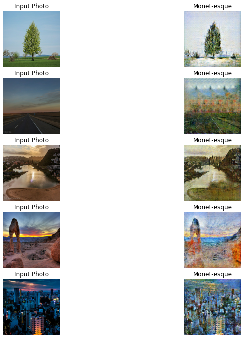

# CycleGAN-style-stransfe

## Contributors
- Trevor Mott

## Introduction 

In this project we take in a dataset with images of monet paintings and pictures of land scapes and cities. I created an CycleGANs model.  

## Business Case

Can you train a model to turn landscapes into monet style paintings for a social media filter? 

- Use picture of Monet painting and photographs to make pictures look like monet paintings. 

## Exploratory Data Analysis

monet painting:

photograph:

### Data Imbalance

These is a data imbalnce with about 700 monet style paintings and 7000 photographs.    

## Modeling Process for CycleGANs

- create 4 CNN two genorators and two discrimintors

- Resized all of the images to 256 X 256 pixels for consistency  

- Created batch size of 300 for each datasets

- The first genortor turns pictures into monets the second turns monets into pictures

- The first discriminator checks to see if it is a painting or not the second check toy see if it is photo or not

### Final CycleGANs Model

It was hard to determ when to stop training I decided to stop after 250 epochs where I was happy with most of the results from the genorator.The results were very tricky to interpret. Because there is not clear cut way to determine the results without looking at each photo individually. I found that most of the time it did the best when it was a picture of a landscape while failing on pictures of people.

These are a good example of the times it does a really good job and when it fails to tranfer the style properly.  
---

## Recommendations and Future Work 

Looking at the model, we would recommend:

We would recommend using this a filter for landscapes mostly to get the best resuls and most aesthetically pleasing images. 

### Future Work:

- Get more pictures of monets to use to train the GAN on.

- Do more models to try and optimize results testing more epochs.

- Try and find different more urban and people focused monets to improve results in those situations. 

### Link To Data Set 

https://www.kaggle.com/c/gan-getting-started/data
